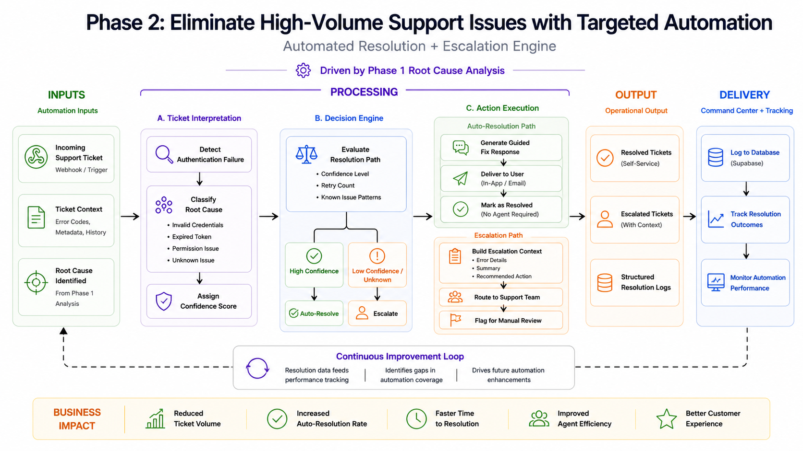
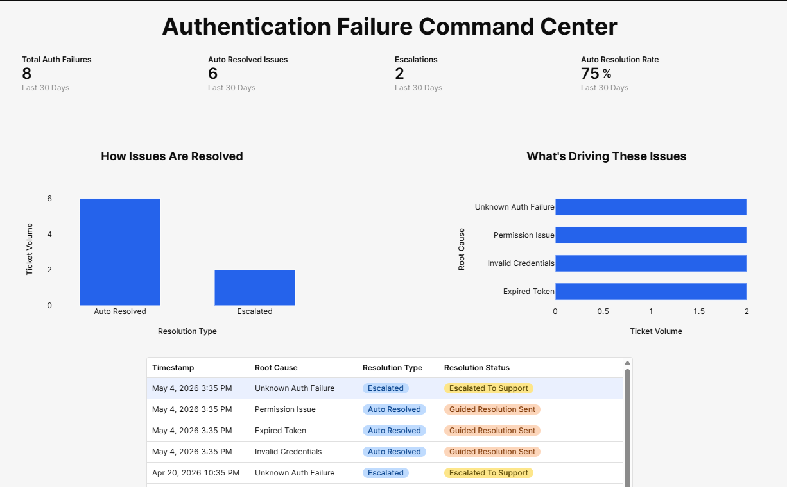

# Case Study: Eliminating High-Volume Support Issues with Targeted Automation (Phase 2)

A real-world style automation system designed to reduce support demand by resolving and tracking high-frequency issues identified through root cause analysis.

---

## Overview

Support teams don’t just need to understand what’s driving tickets—they need to fix it and prove it’s working.

In most organizations:
- Root causes are identified but not acted on  
- Repetitive issues continue generating tickets  
- There is no clear visibility into whether fixes are actually reducing volume  

This case study demonstrates how to:

> **Eliminate high-volume support issues—and measure the impact of those fixes over time.**

---

## Who This Is For

This system is designed for:

- B2B SaaS companies with recurring support issues  
- Teams handling 500–10,000+ tickets per month  
- Organizations with identified root causes but no automation or tracking strategy  
- Support leaders focused on reducing ticket volume and proving results  

---

## Architecture

This system is built as a **closed-loop automation and monitoring system**:

1. Ticket Interpretation  
2. Decision Engine  
3. Automated Resolution + Escalation  
4. Outcome Logging  
5. Command Center Monitoring  

---

## Problem

Following root cause analysis, authentication-related issues were identified as a recurring driver of support demand.

Across a dataset of 1,000 tickets:
- ~85 tickets (~8.5%) were related to authentication failures  
- All were handled manually  
- Most followed predictable patterns  

These included:
- Invalid credentials  
- Expired tokens  
- Permission-related issues  
- Unknown authentication failures  

As a result:

- Agents spent time on repetitive, low-complexity issues  
- Resolution steps were known but not systematized  
- No mechanism existed to validate whether improvements were working  

> The problem wasn’t just fixing issues—it was proving that fixes reduced ticket volume.

---

## Solution

This system simulates how a support team would implement and monitor a targeted automation to eliminate a high-volume root cause.

Using insights from Phase 1, this workflow:

- Classifies incoming authentication issues  
- Determines whether they can be resolved automatically  
- Executes guided fixes for common cases  
- Escalates complex issues with full context  
- Logs outcomes to a structured database  
- Feeds a Command Center to track performance over time  

Instead of improving how tickets are handled, this approach focuses on:

> **Reducing ticket volume—and making that reduction measurable.**

---

## What This Workflow Does

- Simulates inbound support tickets  
- Classifies authentication-related issues  
- Assigns confidence to each classification  
- Routes tickets based on resolution logic  
- Generates automated responses for simple issues  
- Escalates complex issues with structured context  
- Logs all outcomes for tracking and analysis  
- Feeds a Command Center dashboard for monitoring  

---

## How It Works

### 1. Ticket Simulation

- Manual trigger simulates incoming support tickets  
- Includes:
  - Error codes  
  - Metadata  
  - Retry attempts  
  - Issue context  

---

### 2. Ticket Interpretation

- Detects authentication-related failures  
- Classifies root cause:
  - Invalid credentials  
  - Expired token  
  - Permission issue  
  - Unknown issue  
- Assigns confidence level  

---

### 3. Decision Engine

Evaluates how each ticket should be handled based on:

- Classification confidence  
- Retry count  
- Known issue patterns  

**Decision Paths:**
- High confidence → Auto-resolution  
- Lower confidence / unknown → Escalation  

---

### 4. Action Execution

#### Auto-Resolution Path

- Generates guided fix response  
- Sends resolution to user (in-app or email)  
- Marks ticket as resolved  
- No agent required  

---

#### Escalation Path

- Builds structured escalation context:
  - Error details  
  - Issue summary  
  - Recommended action  
- Routes to support team  
- Flags for manual review  

---

### 5. Outcome Logging

All actions are logged to a structured database (Supabase):

- Resolution type (auto vs escalated)  
- Root cause classification  
- Confidence level  
- Whether agent involvement was required  
- Business outcome  

---

### 6. Command Center Monitoring

A centralized dashboard provides visibility into automation performance and impact.

The Command Center tracks:

- Total authentication-related issues  
- Auto-resolved vs escalated tickets  
- Auto-resolution rate  
- Root cause distribution  
- Resolution outcomes over time  

This creates visibility into:

- What percentage of tickets are being eliminated  
- Which issues are still driving escalations  
- Where additional automation opportunities exist  

---

## Example Outputs

### Automated Resolution

- Issue: Permission scope issue  
- Action: Guided fix sent to user  
- Outcome:
  - Resolved without agent involvement  
  - Logged as self-service resolution  

---

### Escalation with Context

- Issue: Unknown authentication failure  
- Action:
  - Escalation created with full context  
  - Routed to support team  

- Outcome:
  - Faster triage  
  - Reduced investigation time  

---

## Key Insight

Automation without measurement doesn’t reduce support demand—it just shifts it.

> The combination of automation + tracking is what enables real volume reduction.

---

## Expected Impact

Based on simulation:

- ~70–75% of authentication tickets can be auto-resolved  
- Significant reduction in repetitive agent work  
- Faster resolution for end users  
- Clear visibility into automation effectiveness  

These improvements come from eliminating repeat work—not optimizing response speed.

---

## What Happens After This

This system demonstrates how to eliminate and track a single high-volume root cause.

From here, the next step is to:

- Expand automation to additional drivers  
- Monitor performance across categories  
- Continuously refine resolution logic  
- Scale across support operations  

---

## Why This Matters

Most teams focus on:

- SLAs  
- Response times  
- Agent productivity  

But:

> Support doesn’t scale by handling tickets faster.  
> It scales by eliminating the reasons tickets exist—and proving it.

---

## How It's Built

- **n8n** (workflow orchestration)  
- **AI-based classification logic**  
- **Supabase (Postgres)** for logging  
- **Retool** for Command Center dashboard  

---

## Files Included

- `Snowflow - Phase 2 - Auth Demo - v1.json` → n8n workflow  
- `process-flow.png` → System flow diagram  
- `architecture-screenshot.png` → Workflow architecture  
- `command-center-screenshot.png` → Command Center dashboard  
- `payload-automation-resolution-screenshot.png` → Auto-resolution example  
- `payload-escalated-screenshot.png` → Escalation example  
- `Case Study Prompt.docx` → Case study narrative  

---

## Case Study Series

This project is part of a broader system focused on:

- Identifying root causes (Phase 1)  
- Eliminating high-volume issues (Phase 2)  
- Tracking and validating impact through automation  

---

## Author

Built by Jesse Snow  
Focused on **Support Operations, AI Automation, and Scalable Systems Design**

---

## Notes

- This case study uses a simulated dataset and workflow  
- Designed to represent how production systems would operate  
- Demonstrates a repeatable approach to reducing and measuring support demand
